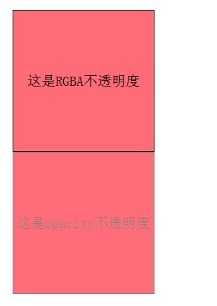

#  自己的总结

- [user-select](#user-select)
- [rgba和opacity区别](#rgba和opacity区别)
- [文字超出范围显示...](#文字超出范围显示...)
- [伪类实现文字两边横线效果](#伪类实现文字两边横线效果)
- [less一种写法](#less一种写法)
- [css继承](#css继承)
- [css输入其他模块](#css输入其他模块)
- [新元素兼容问题](#新元素兼容问题)
- [-webkit-line-clamp](#-webkit-line-clamp)
- [salc()](#salc)
- [select样式修改](#select样式修改)


## user-select
- user-select: none; 属性会影响到  position 属性

```
a{
  overflow-x: scroll;
  white-space: nowrap;
  position: relative;
}

上述样式实现了 滚动条跟随scroll滚动


如果添加 user-select
a {
  overflow-x: scroll;
  white-space: nowrap;
  position: relative;
  user-select: none;
}

则无法实现 滚动条跟随scroll滚动
```


## rgba和opacity区别


- 区别  

opacity会继承父元素的opacity属性,而RGBA设置的元素的后代元素不会继承不透明属性。  

```
.rgba{
   background: rgba(255,0,0,0.5);
}

.opacity{
  background: red;
  opacity: 0.5;
}

```




## 文字超出范围显示...


```
div:line-limit-length {
  overflow:hidden;
  text-overflow:ellipsis;
  white-space:nowrap; // 文本不换行，这样超出一行的部分被截取，显示...
}
```


## 伪类实现文字两边横线效果

```
<div className='content'>中间文字，两边横线</div>
...


  .content div:after,.content div:before{
    background: #000000;  
    content: "";  
    height: 1px;  
    position: absolute;  
    top: 50%;  
    width: 20%;  
  }

/*调整背景横线的左右距离*/  
  .content div:before {  
    left: 0;  
  }  

  .content div:after {  
    right: 0;  
  } 

```


## less一种写法


```
import styles from './666.less'

...
  <div className={styles.aaa}>
    <div className={styles.bbb}>
      ...
    </div>
  </div>

 ... 

```

./666.less
```
  .aaa {
    :global{
      ...
    }
  }

  .bbb {
    :global{
      ...
    }
  }

...


ps :  CSS Modules 允许使用 :global(.className)的语法,声明一个全局规则。凡是这样的声明的class 
      都不会被编译成哈希字符串。

 example:

    .title {
      color: red;
    }

    :global(.title) {
      color: green;
    }
  运行显示为绿色

  :local(.title) === :global(.title)

```


## css继承

```
 一个选择器可以继承另一个选择器的规则，这称为"组合"  ("composition")


 .className {
  bacground-color : blue;
 }

 .title {
  composes : className;
  color: red;
 }

...

例子
import React from 'react';
import style from './App.css';

export default () => {
  return (
    <h1 className={style.title}>
      Hello World
    </h1>
  );
};

背景颜色是 蓝色

```


## css输入其他模块

- 选择器可以继承其他CSS文件里面的规则  

./another.css
```
  .className{
    background-color : blue;
  }
```

./App.css可以继承another.css里面的规则。
```
  .title {
    composes : className from './anther.css';
    color:red
  }
```


## 新元素兼容问题

```
  <header> : 描述了文档的头部区域，于定义内容的介绍展示区域
  <nav> : 定义导航链接的部分
  <section> : 定义文档中的节(section,区段)。比如章节，页眉，页脚或文档的其他部分，section通常包含了一组内容及其标题。
  <artical> : 定义独立的内容。
  <aside> : 定义页面主区域内容之外的内容(比如侧边栏)。
  <figure> : 标签规定独立的内容(图像，图标，照片，代码等)。
  <figcaption> : 定义<figure> 元素的标题。
  <footer>：述了文档的底部区域，一个页脚通常包含文档的作者，著作权信息，链接的使用条款，联系信息等.


```

- 为了让这些块及元素在所有版本的浏览器中生效，你需要在样式表文件中设置一下属性 (以下样式代码可以让旧版本浏览器支持本章介绍的块级元素):

```
header, section, footer, aside, nav, article, figure  
{   
    display: block;   
}  
```


## -webkit-line-clamp

-webkit-line-clamp是一个 不规范的属性（unsupported WebKit property），它没有出现在CSS规范草案中。  
限制在一个块元素显示的文本的行数。为了实现该效果，它需要组合其他外来的WebKit属性。常见结合属性：  

display: -webkit-box: 必需结合的属性，将对象作为弹性伸缩盒子模型显示。  
-webkit-box-orient: 必须结合的属性，设置或检索伸缩盒子对象的子元素的排列方式。  
text-overflow:可以用来多行文本的情况下，用 省略号“...”隐藏超出范围的文本。  
-webkit-line-clamp:<number> number用于显示的行数。  
-webkit-box-orient默认是水平的，当值设为vertical时为垂直排列。  

```
css {
  overflow: hidden;
  text-overflow:ellipsis;
  display:-webkit-box;
  -webkit-line-clamp:2;
  -webkit-box-orient:vertical;
}
```


## salc

例子 :  
```

> width : ~"salc(100% -240px)"  
css3的calc()函数。这里的意思是设置宽度比100%的宽度少240px。  
calc()函数用于动态计算长度值。   
calc()函数指出"+","-","*","/"运算。  
calc()函数使用标准的数学运算优先级规则。

```

## select样式修改

```css
  border: none;               //清除select的边框样式
  outline: none;              //清除select聚焦时候的边框颜色
  width: 100%;                //将select的宽高等于div的宽高
  height: 40px;
  line-height: 40px;
  appearance: none;           //隐藏select的下拉图标
  -webkit-appearance: none;
  -moz-appearance: none;
  padding-left: 60px;         //通过padding-left的值让文字居中
```
